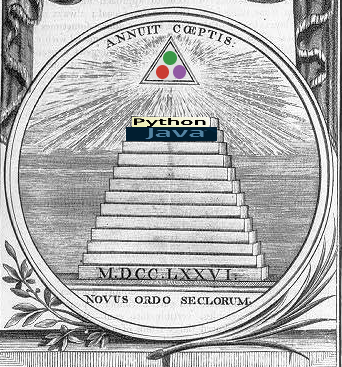
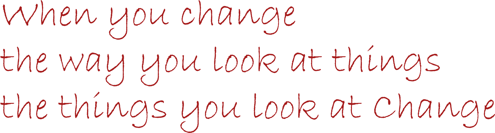
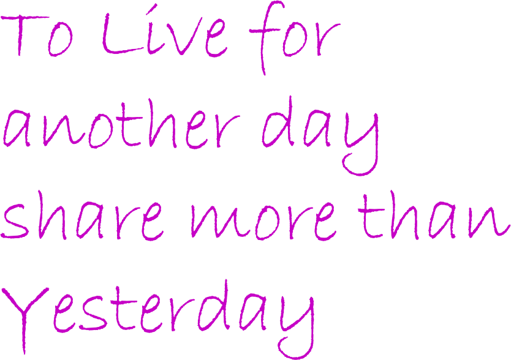
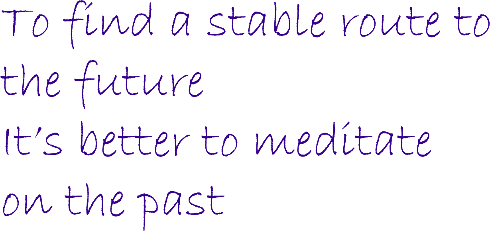

# 🐉 Pathei-Mathos

the __Right Mindset__, you start with:  
- the Golden Rule: "know that there is ~~everything~~ `something` for everyone, which stems from : 
1.1. **Close**: an `open-loop`: that exiting process, One loop at a time, promise?)  
1.2. **Do**: a Minor good (that, whichever you may percieve )  
1.3. **Redo**: N.#1.1 _(only it gets better, with time)_  
- Feel at ease with the Painful _Disappointement of Failure_ (by doing this life algorithm
(as a programmer, you sure got used to the ERROR Message, I presume ) 
2.1. **Learn**: something similar: easy to maintain  (does`ERROR!` sound familiar?) worst case, youd be losing the current battle _(cut your losses short)_  
2.2. **Do**: the work, daily , & care less about any outcomes - remember, you are living in a goal-less life  
2.3. **Magic**: ah, that moment, when the magic comes- invites you  enter into the `Zone`  
and be in the moment- thats when life becomes Fruitful 

(if you're hopped on , don't celebrate, continue the work, till:  
-of course, do not forget to:
3.1.**Enjoy**: admire _the simplicity_,of Doing `the Hobby`  
3.2.**Flow**:  by not forcing anything. The other way, you gotta already **be flowing** in it (& with it), 
changing between the lanes of life's many crisscrossing paths  
(until `min(bladder_capacity, programming[High], hunger)` - Assuming no phone is on-Board! ) 
3.3.**Recall**: being rooted & _( sounds like you've forgetten how to breathe,again)_
 [the pure addition of `_"only getting Exhalted from (overly) getting Excited"_ ` is to binge on] 
 
    
## 🎉 Fun Trivia

- Honours **Open Source**

- Vegan & Spiritual, Functional working bee- (_goodies_ in, _goodies_ out). In a search of a lost _Stability_ (even in a materialistic realm) 

- Appreciate _Spacing Out_ (&  the Creativity it brings)

- _Syrian_, burned my vessesls, & Entered the **United States**, Despite disrimanatory irritation of the few,
Only have earned it,
with the _Love_, _Democracy_ & _Justice_ of the **People**  &#x1F1FA;&#x1F1F8; 🤠 🇺🇸

- **4 hrs** is average Recharge time (+/- 2 hrs variance ) -_Siestez, c'est parfait, alors!_- unless I'm truly sick, (better yet , having a Spiritual Revelation)_

- **TV no more** but appreciate small things-  (_the smell of the earth, while the teardrops trickling on a windowpane is a pure Camelot_)

- Stuck between **the Dichotomy** of this _Occam's Razor_: Sweetness of a _Coconut_, & the Bitterness of _Dark Chocolate_ (to be frank, how *One day*  the `inner-self` proves helpful, but  becomes disobidient on other ones)

- Currently Programming: 
1. [*DeepLearner*](https://github.com/adamwillisXanax/DeepLearner)
2. [_Accouting_](https://github.com/adamwillisXanax/Thee-accountant) 
3. [_Finance_](https://github.com/adamwillisXanax/SolvencyPredictor/blob/main/README.md)

- Future projects 
1. _Econmics_ ( _AI_ empowered **soon**,_lah_)(_the Hard Truth:_**It's a Stochastic Process Optimization**)
2. _**stochastic Processes** (_levy process_, _Laplacian_,..)
3. **Genetic algorithm** with Reinforcement Learning model
4. ***Mathemematics** (Functionals  et al.)
5. _(Statistical) **Physics**_ (Abstract Algebra et al.)
## How About You?

I'm a bit low on **Telephathy**, so I couldn't exactly Tell what _'Turns your Rocker'_? 😄

If there are an ideas you'd like me to try out, _experiment_, _explore_,& [**create**]- any sand castels to build? 
considering the fact that I'm free _(I'd be Glad to take a look at it)_ 

## Current Plateau
the **Fractional** [_Ornstein-Uhlenbeck model_](https://scholar.google.com/scholar?hl=en&as_sdt=0%2C9&q=Fractional+Ornstein-Uhlenbeck+model&btnG=)  & above
-**Hilbert space** functions, & other Quantum pals 
_(You gotta love it- living here,  for a while...)_

# Life's Direction

## Overview

### &#x1F5EF; Creativity Mantra†

## &#x1F31F; Motivation

## Author

